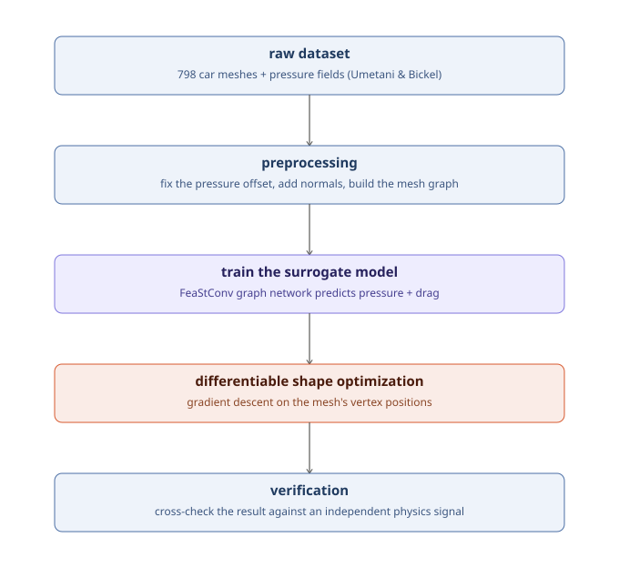
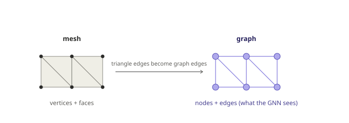
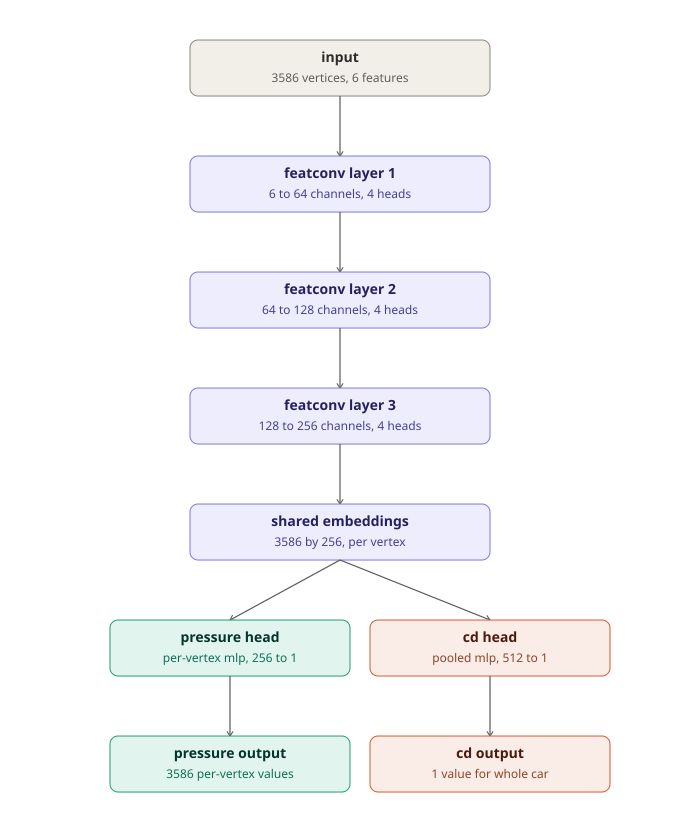
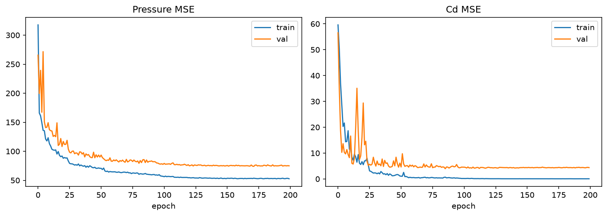
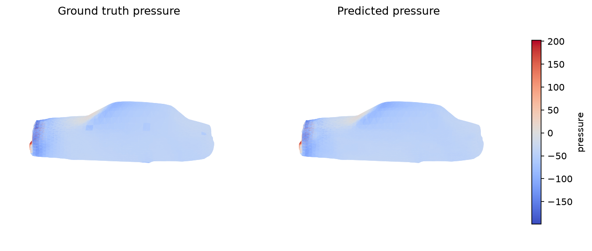
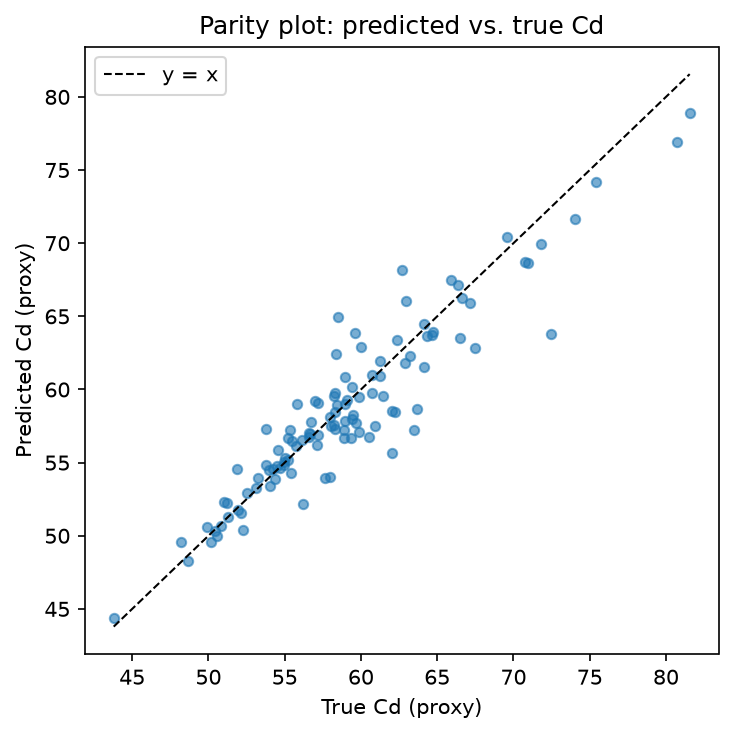
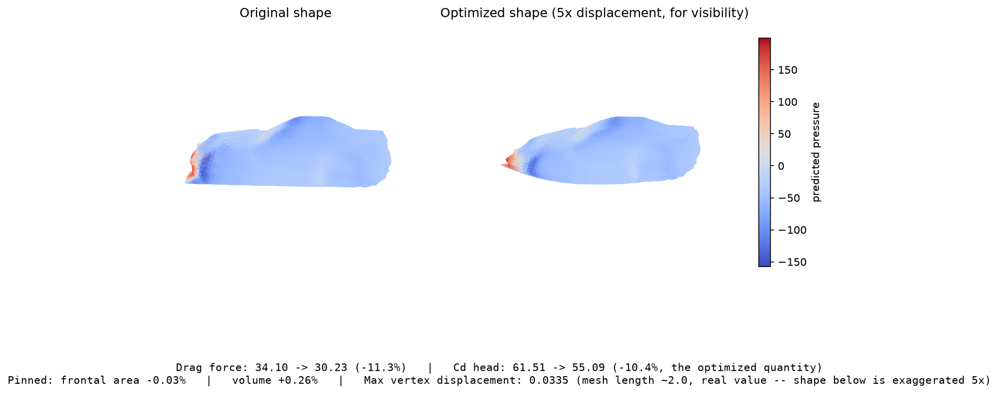

# NeuralDrag

Training a graph neural network to approximate a CFD (computational fluid dynamics)
simulation on car geometry, then using that trained, frozen network as a
**differentiable proxy** to reshape a car by gradient descent instead of by
trial-and-error simulation.

This is a learning project, not a validated engineering tool. Read
[Scope and limitations](#scope-and-limitations) before drawing any conclusion from
the numbers below. It was built with the assistance of an AI coding assistant
(Claude, Anthropic); see [Acknowledgments](#acknowledgments).

## Why this exists

Real CFD solves the Navier-Stokes equations over a 3D mesh. It is accurate and slow
— one simulation can take tens of minutes on a proper solver. A line of research,
including the paper this project is modeled on, asks two questions: can a neural
network learn to approximate that simulation directly from geometry, so a prediction
takes milliseconds instead of minutes? And since the network is differentiable, can
its gradients be used to *improve* a shape directly, rather than only scoring a shape
a human already proposed?

> Baqué, P., Remelli, E., Fleuret, F., and Fua, P. (2018). **Geodesic Convolutional
> Shape Optimization.** *Proceedings of the 35th International Conference on Machine
> Learning (ICML)*, PMLR 80:472-481. [arXiv:1802.04016](https://arxiv.org/abs/1802.04016)

This project reproduces the core mechanic at a small, tractable scale: a mesh-aware
graph network standing in for the simulator, and gradient descent flowing through
that network's frozen weights and back into the car's own geometry.

## Scope and limitations

Stated up front, because every number in this document sits inside these bounds.

- **The drag values here are not real drag coefficients.** The dataset ships no Cd
  label, so this project derives a [pressure-drag proxy](#the-cd-proxy) from the
  pressure field. It omits skin friction entirely and is normalized by neither air
  density nor flow velocity, because neither appears in the data.
- **Nothing here is validated against a solver.** The optimized shapes were never
  re-simulated. Every reported improvement is the surrogate evaluating itself, which
  is exactly the arrangement most likely to flatter the result. See
  [How to judge the result](#how-to-judge-the-result) for what is done instead, and
  why it is weaker than real validation.
- **The Cd head is fit on 450 single-scalar labels** and visibly overfits (final
  train MSE 0.06 versus validation 4.39). It generalizes usefully (test R² 0.87) but
  it is the weakest link in the chain.
- **No volumetric flow field is modeled.** This is a surface-pressure-and-geometry
  reproduction of the paper's idea, not a Navier-Stokes replacement.
- 611 usable shapes is a small dataset for a deep surrogate.

## Pipeline



| Stage | Notebook |
|---|---|
| Raw dataset, preprocessing | [notebooks/data_pipeline.ipynb](notebooks/data_pipeline.ipynb) |
| Train the surrogate | [notebooks/build_model.ipynb](notebooks/build_model.ipynb), [notebooks/train_model.ipynb](notebooks/train_model.ipynb) |
| Shape optimization, verification | [notebooks/shape_optimization.ipynb](notebooks/shape_optimization.ipynb) |
| Every number in [Results](#results) | [notebooks/evaluation.ipynb](notebooks/evaluation.ipynb) |
| Every figure in this document | [notebooks/visualization.ipynb](notebooks/visualization.ipynb) |

Run them in that order. `src/` holds everything reusable, so no logic is duplicated
between notebooks.

## The dataset

The ShapeNet-Car pressure data released alongside:

> Umetani, N. and Bickel, B. (2018). **Learning Three-Dimensional Flow for
> Interactive Aerodynamic Design.** *ACM Transactions on Graphics (SIGGRAPH)*,
> 37(4), Article 89.

Processed release used here: Zenodo record
[13737721](https://zenodo.org/records/13737721) — 798 car meshes, each with a
per-vertex surface pressure field from a real Navier-Stokes simulation, plus a
500/111 train/test split manifest.

**The dataset is not in this repository** (see `.gitignore`) — it is not this
project's data to redistribute. Download the processed release from the Zenodo
record and extract it to `processed-car-pressure-data/` at the repository root.

| Provided | Not provided |
|---|---|
| Per-vertex 3D positions | Surface normals (computed here) |
| Triangle/quad face connectivity | A validation split (carved out of the training IDs here) |
| Per-vertex surface pressure | A drag coefficient label (a proxy is derived here) |
| A 500/111 train/test ID split | Any documentation of the two quirks below |

### Two quirks in the raw files, found and fixed

Both had to be resolved before training on this data would mean anything.

**1. Two incompatible mesh formats share one folder.**
`processed-car-pressure-data/data/` contains 611 triangulated meshes (3586 vertices
each) that make up the *entire* official train/test split, plus 187 unsplit quad
meshes (3682 vertices each) referenced by no manifest at all. This project trains
only on the official 611-sample split, and carves a fixed 50-shape validation set
out of the 500 training IDs, giving **450 train / 50 validation / 111 test**.

**2. A silent 96-entry offset between the pressure array and the mesh.** Every
`press_NNN.npy` file is exactly length 3682 regardless of mesh class, but the 611
triangulated meshes have only 3586 vertices. Naively indexing `pressure[i]` against
vertex `i` would train the entire pressure head on scrambled labels.

This was diagnosed with a face-adjacency smoothness test. Real surface pressure
changes gradually between two physically adjacent points, so
`mean(|pressure[i] - pressure[j]|)` over mesh-connected vertex pairs should be much
smaller than the same quantity over random pairs. Indexing straight
(`pressure[:3586]`) gave no such signal — ratio ≈ 1.0, meaning no correlation
whatsoever. Slicing `pressure[96:]` instead gave a strong, consistent signal
(ratio ≈ 0.15), matching the unambiguous 187-mesh subset used as a positive control,
and it held across all 611 files. The offset is most likely a byproduct of a
watertight-repair step (the file headers name Open3D as the mesh producer) that
welded away 96 duplicate or degenerate vertices while leaving their pressure values
sitting at the front of the array. The fix is one line, in `src/data.py`.

## From mesh to graph



The dataset provides real mesh connectivity, not just a point cloud, so this builds a
genuine mesh graph rather than falling back on a distance-based k-nearest-neighbor
graph: every vertex becomes a node, and every edge of every triangle becomes an
undirected, deduplicated graph edge. The network's notion of "neighbor" therefore
follows the car's actual surface, which is the closer analogue to the source paper's
geodesic-convolution idea — filters that respect surface geometry rather than raw
Euclidean distance.

For one car: **3586 vertices, 7168 triangular faces, 21504 directed graph edges.**

## The surrogate model



Each vertex carries 6 input numbers: its 3D position (normalized into a unit
bounding box) concatenated with its surface normal (a 3D unit vector). Normals are
not in the dataset, so they are computed by averaging the normals of the surrounding
triangle faces, weighted by face area.

Three `FeaStConv` graph-convolution layers process these, each followed by batch
normalization and a ReLU, with channels progressing 6 → 64 → 128 → 256. The
per-vertex embeddings then split into two heads: a per-vertex MLP predicting
pressure, and a global mean+max pooling followed by an MLP predicting one
whole-shape Cd value.

### Why FeaStConv

An image convolution works because pixels have a fixed, canonical neighborhood — "the
pixel above me" always means the same physical direction, so a kernel can learn one
weight per neighbor slot. Mesh vertices have no such ordering: one vertex's neighbor
might sit to its left and another's to its front, with no shared frame of reference.

`FeaStConv` (Verma et al., *FeaStNet: Feature-Steered Graph Convolutions for 3D Shape
Analysis*, CVPR 2018) learns several ("heads") weight matrices per layer, plus a
gating function that decides — per edge, from the *relative position* of the two
vertices — how much of that edge's message routes through each matrix:

```
for vertex i, neighbor j:
    gate = softmax_over_heads( learned_linear_function(position_j - position_i) )
    message(i, j) = sum over heads h of  gate[h] * (W_h · feature_j)

new_feature_i = bias + sum over neighbors j of message(i, j)
```

This gives an orientation-aware filter on an irregular mesh without a predefined
local coordinate frame. This project uses 4 heads per layer.

## The Cd proxy

No ground-truth drag coefficient exists anywhere in the dataset — only per-vertex
pressure. Since Cd is the paper's optimization target, one is derived from the
pressure field via the standard pressure-drag integral:

```
drag_force = sum over faces of ( mean_face_pressure × normal_z × face_area )

Cd_proxy   = drag_force / reference_area
```

This captures pressure drag only. It omits the viscous/skin-friction component and
is normalized by neither flow velocity nor air density, so it is a
physically-motivated stand-in, not a wind-tunnel-calibrated Cd.

### The reference area

`reference_area` is the car's frontal (silhouette) area, computed as
`0.5 × Σ |normal_z| × face_area` over every face — exact for a convex closed
surface, since every line along the flow axis crosses it exactly twice.

**An earlier version used the bounding-box cross-section instead, and that was a real
defect.** A bounding box is set by four extreme vertices, which makes it barely
differentiable, and it over-estimates the area a car actually presents to the flow by
**7.3%** on this data — 0.4530 against 0.4223 on average. The two are also not a fixed
rescaling of one another (the ratio is 0.932 with a spread of 0.028), so the choice
changes how cars rank against each other, not merely the units.

Worse, the reference area sits in a denominator the optimizer descends on, so
*widening the car* lowers the score without improving anything aerodynamic. Switching
to the smooth projected area removes the four-vertex sensitivity; pinning the area
during optimization (below) removes the exploit.

### The sign correction

The formula above, computed directly, comes out negative on every shape in the
dataset — not because drag is negative (it never is; drag always opposes motion) but
because of an interaction between the mesh files' face-normal winding order and the
choice of flow axis. Two checks resolve it:

1. **Normal orientation, via the divergence theorem.** Integrating
   `centroid · normal × area` over every face of a closed mesh recovers its enclosed
   volume if and only if the normals point outward. Run across **all 611 meshes**,
   this returns a positive volume every time (611/611), confirming outward normals
   universally rather than on a spot-check.
2. **The physical pressure-drag relation**, `force = -∮ p · n_outward dA` — pressure
   pushes *into* a surface, against its outward normal. Combined with confirmed
   outward normals and the empirically observed high pressure at the car's nose
   (where the outward normal points backward, against travel), the sign that recovers
   a positive, physically meaningful drag is **the negation of the raw formula**. The
   raw integral is negative on 611/611 shapes, so this correction is uniform.

`CD_PHYSICAL_SIGN = -1`, defined in `src/shape_opt.py`, is applied everywhere Cd is
displayed or optimized against.

Getting this wrong is not cosmetic. An early version of the optimizer minimized the
*raw*, incorrectly signed output, which — as the derivation makes obvious in
hindsight — was silently **maximizing** drag, while every number and plot looked
internally consistent.

## Training

Adam, learning rate 1e-3 with `ReduceLROnPlateau`, batch size 4, 200 epochs. Loss is
`MSE(pressure) + MSE(cd)` in standardized units, with statistics computed from the
training set only. About 15 s/epoch on a laptop RTX 3060 (50 minutes total).

Batch size 4 and 4 attention heads per layer are deliberate. An earlier configuration
(batch size 8, 9 heads) was measured to exceed the 6 GB VRAM available and silently
fall back to shared system memory — roughly 15× slower per epoch, with no error
raised. Worth checking for on any memory-constrained GPU.



## Differentiable shape optimization

The signature piece: freeze every trained weight, take a held-out test car, and make
the *geometry* the thing gradient descent updates. A forward pass produces a
predicted Cd; backpropagation carries gradients from that scalar back through the
frozen network into the car's shape. Stepping the optimizer reshapes the car toward
lower predicted drag.

Done naively this fails badly, in two distinct ways that both took real work to
close.

### 1. Optimize a shape space, not vertices

Descending directly on vertex positions gives the optimizer **10,758 degrees of
freedom** (3586 vertices × 3) against a surrogate trained on 450 shapes — about 24
free parameters per training label. The network only ever saw plausible cars, so its
gradient is only meaningful *on* that data manifold, and step one walks off it.
Everything after that is adversarial-example territory: the optimizer finds spiky,
physically meaningless geometry that fools the Cd head into reporting a large
improvement.

The earlier version fought this with a Laplacian smoothness penalty, an anchor term,
gradient clipping, gradient smoothing, and early stopping. Those restrain *how far*
the optimizer can walk in a meaningless direction; they do not make the direction
meaningful, and the deformation it produced was visibly noisy.

This version instead optimizes **free-form deformation (FFD) control points**
(`src/ffd.py`). A 4×4×6 Bernstein lattice is fitted to the car's bounding box, and
every vertex is expressed as a smooth polynomial function of the 96 control points:

```
pos = B @ P          B: fixed (3586 × 96) basis matrix
                     P: (96 × 3) control points -- the optimized variables
```

That is **288 degrees of freedom instead of 10,758**, and every deformation the basis
can express is C-infinity smooth. High-frequency surface noise is not penalized after
the fact — it cannot be represented at all. Control points start on a uniform grid,
which reproduces the original mesh exactly (Bernstein bases have linear precision;
verified to 1e-16), so initialization is a true identity. The Laplacian and
gradient-smoothing machinery is gone, being redundant.

### 2. Pin the vehicle package, or the optimizer just resizes the car

Cd and drag force are gameable in *opposite* directions:

- **Minimizing Cd rewards a wider car**, because frontal area is Cd's denominator.
- **Minimizing drag force rewards a smaller car**, because less car means less drag.

Fixing only the first exposes the second: the first FFD run against drag force simply
shrank the car and reported that as a win.

So the objective pins both **frontal area** and **enclosed volume** to their starting
values (`gamma_area`, `gamma_volume`, default 300), which holds each to roughly 0.1%.
Reshaping is then the only available way to improve, and drag force and Cd become
equivalent objectives rather than opposed ones. This mirrors real automotive practice,
where drag is minimized subject to a fixed vehicle package.

The full objective:

```
loss = drag_force / |drag_force_initial|          the thing being minimized
     + beta_anchor  * ||P - P_initial||²          trust region on control points
     + gamma_area   * ((A - A₀) / A₀)²            frontal area pinned
     + gamma_volume * ((V - V₀) / V₀)²            enclosed volume pinned
```

plus gradient clipping, and early stopping once the predicted change exceeds 10% of
its starting value — past that point, further "improvement" is increasingly likely to
be exploiting the surrogate rather than reflecting geometry.

## How to judge the result

A predicted improvement from a small, overfit-prone Cd head is weak evidence. Three
checks are applied, in increasing order of how much they should be trusted.

**Do the package constraints actually hold?** If frontal area or volume moved, the
"improvement" is partly the car being resized. This is a hard precondition — check it
before reading any other number.

**Do the two heads agree?** The model's pressure prediction (about 3600 supervised
targets per training shape, versus 1 for Cd) can be fed through the same analytic
formula used to build the Cd labels. If that independently-derived number also
improves, the heads are at least self-consistent.

This is a consistency check, **not independent evidence**, and the earlier version of
this README overstated it. Both heads read from the same shared encoder, so they fail
together. And measured on the test set, the analytic route is the *less* accurate
estimator of the two (R² 0.63 versus 0.87) — it is a noisier signal, not a purer one.

**Is the change bigger than the model's own error bar?** The decisive test, and the
easiest one to skip. If a claimed improvement is smaller than the surrogate's test
RMSE on that same quantity, it is indistinguishable from the model simply being
imprecise — not a small real effect, but no evidence of an effect at all. The ratio
between the two is reported in [Results](#shape-optimization), and a run scoring
below 1.0 there should be treated as having measured nothing.

## Results

Every figure in this section is computed by
[notebooks/evaluation.ipynb](notebooks/evaluation.ipynb) and written to
`outputs/evaluation_metrics.json`, so each one can be regenerated and checked rather
than taken on trust. The single exception is the "before" column of
[the comparison table](#against-the-previous-version), which is flagged there.

### Surrogate accuracy

The pressure head is measured against a geometry-blind baseline: predicting the
per-vertex *mean pressure field* of the training set, an "average car" template that
uses no information about the specific shape.

| Pressure predictor | Test MSE |
|---|---|
| Global scalar mean | 2379.6 |
| Per-vertex mean field (geometry-blind template) | 250.7 |
| **Trained model** | **72.5** |

The model explains **71.1% of the variance the template cannot** — real geometry →
pressure learning, not memorization of an average car.

| Cd predictor (test) | MSE | RMSE | R² |
|---|---|---|---|
| Predict training mean | 42.4 | 6.51 | −0.02 |
| **Cd head** | **5.43** | **2.33** | **0.869** |
| Analytic, from predicted pressure | 15.4 | 3.92 | 0.630 |

The Cd head overfits (final train MSE 0.06 versus validation 4.39) but still
generalizes usefully. Expected: each training shape gives the pressure head ~3600
supervised targets and the Cd head exactly one.



Ground truth (left) versus predicted (right) surface pressure on a held-out test car
— high pressure at the nose, low over the roof, matching the expected physical
pattern.



### Shape optimization

All ten held-out shapes tested reduced predicted drag force, with frontal area and
volume holding throughout.

| Metric | Result |
|---|---|
| Shapes with reduced drag force | **10 / 10** |
| Mean drag force change | **−10.9%** (range −7.6% to −15.0%) |
| Frontal area deviation | ≤ 0.36% |
| Volume deviation | ≤ 0.42% |
| Deformation roughness | **0.022** |
| Max vertex displacement | 0.0335 (mesh spans ~2.0) |
| Change vs. Cd-head test RMSE | **2.70×** (10/10 shapes exceed it) |

Two of those rows carry most of the weight.

**Roughness** is `‖L(d)‖ / ‖d‖`, the fraction of the displacement field that is
high-frequency — 0 for a perfectly smooth deformation, ~1 for per-vertex noise.
Displacement magnitude alone cannot tell a genuine reshaping apart from surface
jitter, which is what this exists to catch. Calibrated on the same mesh: a smooth
low-order mode scores **0.009**, a random field **1.094**. At 0.022 this deformation
is essentially smooth — which is what optimizing a Bernstein cage buys, rather than
something a penalty term had to clean up afterwards.

**Change vs. test RMSE** is the significance check from
[How to judge the result](#how-to-judge-the-result). At 2.70×, the improvement is
comfortably larger than the surrogate's own imprecision, on every shape tested.



Car 753, rendered at 5× displacement exaggeration. The optimizer lowers the roofline
and tapers the tail — a coherent, recognizably automotive change.

## What would actually make this better

Ranked by expected impact. Architecture is not the bottleneck.

1. **Real Cd labels.** The single biggest limitation is that the target is a derived
   proxy. [DrivAerNet++](https://github.com/Mohamedelrefaie/DrivAerNet) (MIT DeCoDE
   Lab, 2024) provides roughly 8,000 car designs with high-fidelity CFD, *actual*
   drag coefficients, and parametric design variables — about 18× the shapes here,
   and it eliminates the proxy entirely. DrivAerML and AhmedML are also worth
   evaluating. *(Verify current licensing and contents; these are named from memory.)*
2. **A solver in the loop.** Without ground truth on the *optimized* shape, there is
   no way to detect being fooled. The standard pattern is active learning: optimize,
   run real CFD (OpenFOAM) on the result, add it to training, retrain, repeat. This
   is the only step that genuinely escapes the surrogate's blind spot.
3. **A learned shape space.** The FFD cage fixes plausibility, but a mesh
   autoencoder's latent code or a dataset's own design parameters would constrain
   deformations to shapes that are *car-like by construction* rather than merely
   smooth.
4. **More Cd supervision.** The 187 excluded quad meshes are more (shape, Cd) pairs.
   The Cd head's overfitting is a data problem, not a tuning problem.

`notebooks/finetune_cd_head.ipynb` documents an attempt at (4) using the model's own
pressure prediction as an auxiliary Cd teacher. It did not work — the Cd head's own
predicted pressure is not a better training signal than the sparse real labels, since
its residual errors get distorted by the nonlinear drag formula in ways uncorrelated
with real generalization. **Its stored numbers predate the current reference-area
change and have not been regenerated**; treat them as historical.

## Project layout

```
notebooks/
  environment_check.ipynb    verify torch / torch_geometric / CUDA are available
  data_pipeline.ipynb        build the train/val/test caches, inspect the raw data
  build_model.ipynb          sanity-check the model's forward pass
  train_model.ipynb          train the surrogate, save the best checkpoint
  finetune_cd_head.ipynb     a documented negative result (see above; not re-run)
  shape_optimization.ipynb   the differentiable optimization and its verification
  evaluation.ipynb           every number in the Results section
  visualization.ipynb        every figure in this README

src/
  data.py         mesh/pressure loading, normals, areas, volume, the Cd-proxy formula
  dataset.py      PyG Data construction (incl. batching mesh faces), caching, stats
  evaluate.py     baselines, regression metrics, roughness, the noise-floor check
  ffd.py          the free-form deformation lattice
  model.py        the MeshSurrogate graph network
  shape_opt.py    the optimization loop, package constraints, sign correction, verification
  viz.py          every plotting/rendering function used by visualization.ipynb

docs/diagrams/    the SVG figures embedded in this README
outputs/          generated checkpoints, caches, and figures (not tracked in git)
```

## Setup

```bash
py -3.11 -m venv .venv
.venv\Scripts\activate

# install torch first, with the right index for your GPU (or the CPU wheel if none)
pip install torch --index-url https://download.pytorch.org/whl/cu121

pip install -r requirements.txt

# optional but recommended: accelerated scatter/sparse ops for torch_geometric.
# Without these, FeaStConv falls back to a much slower path. Match the URL below
# to your installed torch + CUDA version (this project used torch 2.5.1+cu121).
pip install torch-scatter torch-sparse -f https://data.pyg.org/whl/torch-2.5.1+cu121.html

python -m ipykernel install --user --name neuraldrag --display-name "Python 3 (NeuralDrag)"
```

Download the dataset from the [Zenodo record](https://zenodo.org/records/13737721)
and extract it to `processed-car-pressure-data/` at the repository root before
running `data_pipeline.ipynb`.

## Citing this work

If this is useful as a reference, please cite the two works it depends on rather than
this repository, which is a learning exercise built on top of them:

```bibtex
@inproceedings{baque2018geodesic,
  title     = {Geodesic Convolutional Shape Optimization},
  author    = {Baqu{\'e}, Pierre and Remelli, Edoardo and Fleuret, Fran{\c{c}}ois and Fua, Pascal},
  booktitle = {Proceedings of the 35th International Conference on Machine Learning},
  volume    = {80},
  pages     = {472--481},
  year      = {2018},
  publisher = {PMLR}
}

@article{umetani2018learning,
  title   = {Learning Three-Dimensional Flow for Interactive Aerodynamic Design},
  author  = {Umetani, Nobuyuki and Bickel, Bernd},
  journal = {ACM Transactions on Graphics},
  volume  = {37},
  number  = {4},
  pages   = {89},
  year    = {2018}
}
```

## Acknowledgments

Built with the assistance of Claude (Anthropic) while learning computer-aided
engineering and geometric deep learning. The AI assisted with implementation,
debugging, and the investigations documented above — the pressure-offset diagnosis,
the Cd sign derivation, and the reference-area and shape-parameterization fixes in
particular. The resulting design decisions, the verification approach, and their
explanation here reflect that collaborative process.
